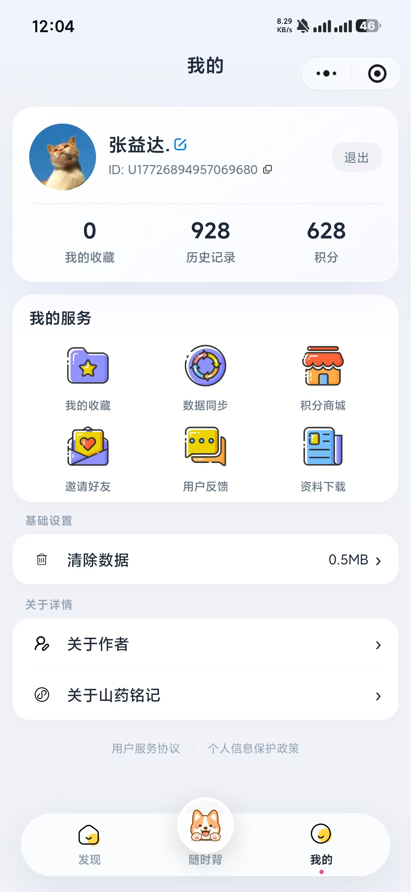
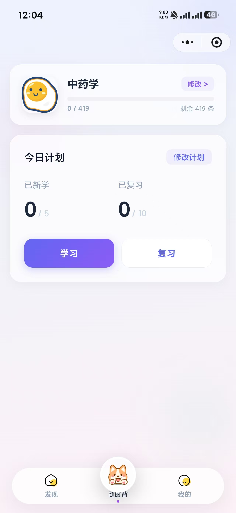
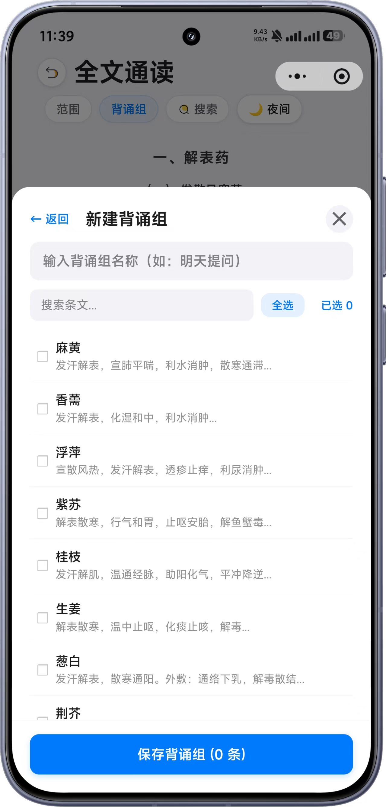

# 山药铭记

一个中医学习工具箱微信小程序，帮助中医爱好者高效学习中医经典知识。

## 项目简介

山药铭记是一款专为中医学习者设计的微信小程序，整合了伤寒论、方剂学、中药学、内经、金匮要略、温病学六大中医经典的学习资源。通过现代化的技术手段，让传统的中医学习变得更加便捷、高效、有趣。

### 核心特色

- **六大经典学习**：涵盖伤寒论、方剂学、中药学、内经、金匮要略、温病学
- **随时背功能**：利用碎片时间进行背诵练习
- **背诵组功能**：组队学习，互相监督
- **学习进度追踪**：记录学习时长和进度
- **收藏与历史**：方便回顾重点内容
- **积分商城**：激励学习机制

## 界面预览

### 首页与个人主页

<p align="center">
  
  &nbsp;&nbsp;&nbsp;&nbsp;
  
</p>

### 工具页面展示

<p align="center">
  
  &nbsp;&nbsp;
  
  &nbsp;&nbsp;
  
  &nbsp;&nbsp;
  
</p>

<p align="center">
  
  &nbsp;&nbsp;
  
  &nbsp;&nbsp;
  
</p>

### 随时背功能

<p align="center">
  
  &nbsp;&nbsp;
  
  &nbsp;&nbsp;
  
</p>

### 特色功能

<p align="center">
  
</p>

## 功能特性

### 学习工具

| 工具 | 说明 |
|------|------|
| 📚 伤寒速速通 | 深入学习伤寒论，掌握经方应用 |
| 💊 方剂速速记 | 快速记忆常用方剂组成与功效 |
| 💊 方剂轻松过 | 方剂诵读练习，巩固记忆 |
| 🌿 中药快快记 | 系统学习中药性味归经 |
| 📖 内经随身背 | 随时背诵内经经典条文 |
| 📖 内经随时背 | 利用碎片时间学习内经 |
| 📋 金匮简易考 | 学习杂病辨治精要 |
| 🌡️ 温病掌上学 | 掌握温病辨证论治方法 |

### 辅助功能

- ⭐ **收藏功能**：收藏重要内容方便复习
- 📝 **学习历史**：记录学习轨迹
- ⏱️ **学习时长统计**：追踪学习进度
- 🎯 **随时背**：碎片时间背诵练习
- 👥 **背诵组**：组队学习互相监督
- 🏪 **积分商城**：学习兑换奖励
- 💬 **用户反馈**：持续改进产品

## 项目结构

```
├── admin/          # 后台管理系统 (Vue 3 + Vite)
├── backend/        # 后端服务 (Node.js + Express + MySQL)
├── docs/           # 项目文档 (API文档、数据库脚本)
├── home/           # 项目主页 (React + Vite)
│   └── 小程序图片/  # 界面截图
├── xcx/            # 微信小程序
└── 云端数据ison/    # 中医数据文件
```

## 快速开始

### 环境要求

- Node.js >= 16
- MySQL >= 5.7
- 微信开发者工具

### 后端部署

1. 进入后端目录：
```bash
cd backend
```

2. 安装依赖：
```bash
npm install
```

3. 配置环境变量：
```bash
cp .env.example .env
# 编辑 .env 文件，填入你的配置
```

4. 初始化数据库：
```bash
# 导入数据库结构
mysql -u your_username -p your_database_name < docs/content_library.sql
```

5. 启动服务：
```bash
npm start
```

### 后台管理系统部署

1. 进入管理后台目录：
```bash
cd admin
```

2. 安装依赖：
```bash
npm install
# 或使用 pnpm
pnpm install
```

3. 配置环境变量：
```bash
# 编辑 .env 文件，配置后端API地址
```

4. 启动开发服务器：
```bash
npm run dev
```

5. 构建生产版本：
```bash
npm run build
```

### 微信小程序部署

1. 使用微信开发者工具打开 `xcx` 目录

2. 配置 `xcx/utils/config.js` 中的API地址

3. 在微信公众平台配置服务器域名

4. 预览或上传小程序

### 项目主页部署

1. 进入主页目录：
```bash
cd home
```

2. 安装依赖：
```bash
npm install
```

3. 启动开发服务器：
```bash
npm run dev
```

4. 构建生产版本：
```bash
npm run build
```

## 配置说明

### 后端配置 (backend/.env)

```env
# 服务器配置
PORT=3000

# 数据库配置
DB_HOST=localhost
DB_PORT=3306
DB_USER=your_database_user
DB_PASSWORD=your_database_password
DB_NAME=your_database_name

# JWT 配置
JWT_SECRET=your_jwt_secret_key_here
JWT_EXPIRES_IN=30d

# 微信小程序配置
WECHAT_APPID=your_wechat_appid
WECHAT_APPSECRET=your_wechat_appsecret
```

### 前端配置 (admin/.env)

```env
# 后端API地址
VITE_BASE_URL=http://your-api-domain.com/api
```

### 微信小程序配置 (xcx/utils/config.js)

```javascript
const config = {
  development: {
    baseUrl: 'http://localhost:3000/api',
    assetHost: 'http://localhost:3000'
  },
  production: {
    baseUrl: 'https://your-api-domain.com/api',
    assetHost: 'https://your-api-domain.com'
  }
};
```

## 数据说明

项目包含以下中医数据：

| 数据集 | 说明 |
|--------|------|
| 伤寒论 (shanghan) | 张仲景《伤寒论》内容 |
| 方剂学 (fangji) | 常用方剂数据库 |
| 内经 (neijing) | 《黄帝内经》核心内容 |
| 中药学 (zhongyao) | 中药性味归经数据 |
| 金匮要略 (jinkui) | 张仲景《金匮要略》内容 |
| 温病学 (wenbing) | 温病学派经典内容 |

数据文件位于 `云端数据ison/` 目录，可通过后端脚本导入数据库。

## 技术栈

### 后端

- **运行时**：Node.js
- **框架**：Express
- **ORM**：Sequelize
- **数据库**：MySQL
- **认证**：JWT

### 后台管理系统

- **框架**：Vue 3
- **构建工具**：Vite
- **UI库**：Element Plus
- **类型**：TypeScript

### 微信小程序

- **开发方式**：原生开发
- **技术**：WXML / WXSS / JavaScript

### 项目主页

- **框架**：React
- **构建工具**：Vite
- **类型**：TypeScript
- **样式**：Tailwind CSS

## 文档

- [后台管理 API 文档](docs/Admin-API文档.md)
- [微信小程序 API 文档](docs/XCX-API文档.md)
- [数据库结构](docs/content_library.sql)

## 贡献指南

欢迎贡献代码！请遵循以下步骤：

1. Fork 本仓库
2. 创建你的特性分支 (`git checkout -b feature/AmazingFeature`)
3. 提交你的更改 (`git commit -m 'Add some AmazingFeature'`)
4. 推送到分支 (`git push origin feature/AmazingFeature`)
5. 打开一个 Pull Request

## 许可证

本项目采用 MIT 许可证 - 查看 [LICENSE](LICENSE) 文件了解详情

## 联系方式

- 邮箱：2938307109@qq.com

## 致谢

感谢所有为中医传承和发展做出贡献的人！
